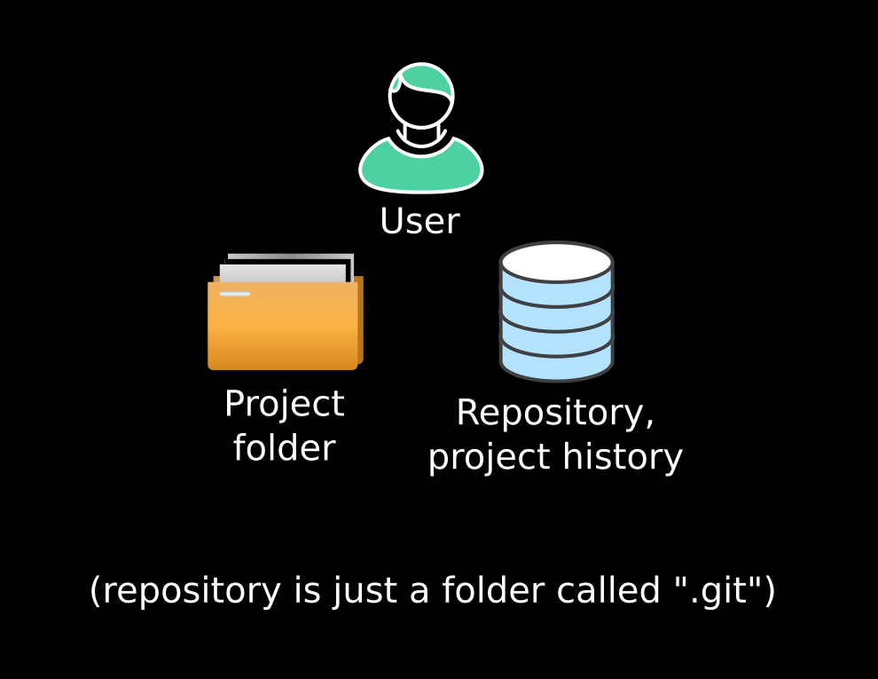
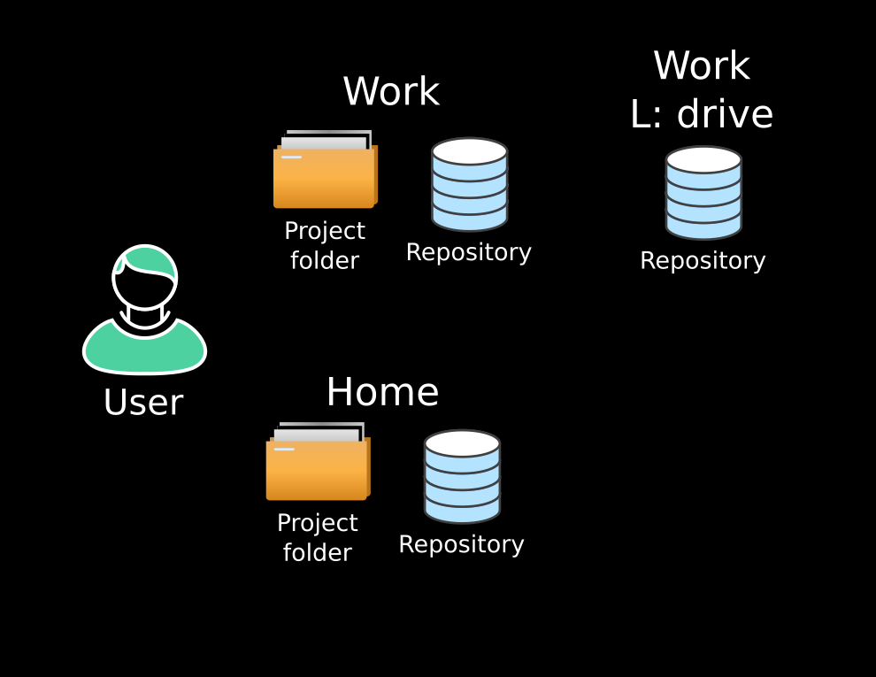
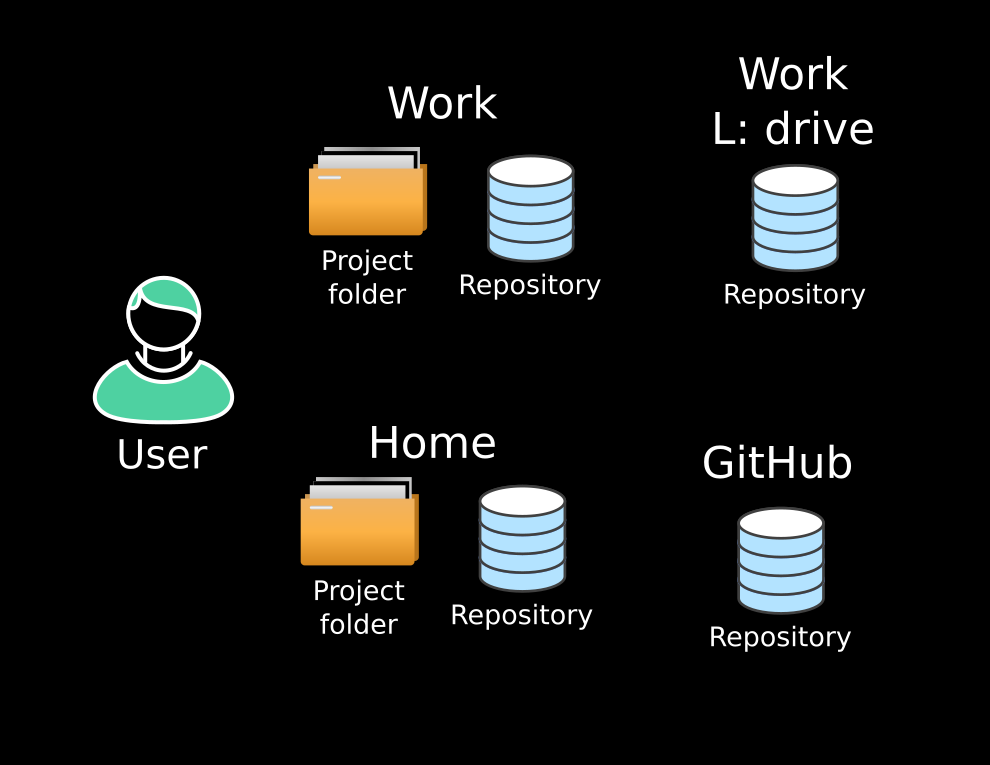
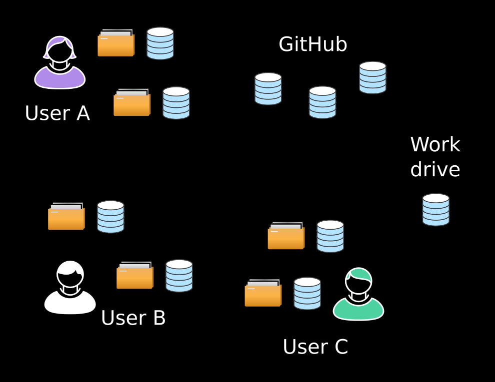
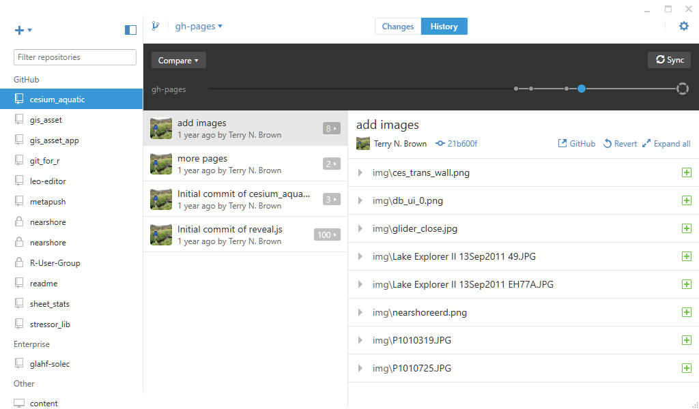

# Git(Hub) and Python

https://tbnorth.github.io/PyCoPGit/

Brown.TerryN@epa.gov


## How Version Control works

 - records the changes (or absence of change) for files between
   commits

 - git also uses “hashes” (digital fingerprints) as a filing system

 - hashes give git extra features in terms
   of verifiable or non-revisable data analysis processes

 - modern VC systems snapshot the state of all the files in a project,
   not just individual files (vs. older systems like RCS)


## Version control and Data Science

 - Add and commit received data files, git confirms they
   haven't changed (or tracks changes you choose to make)

 - Add and commit outputs, git lets you know when they
   change, and when they don't


## Version control and Data Science

 - e.g. your code's finally working, and you want to
   delete all the junk that wasn't part of the solution

   As well as letting you undo deletions if you need to, git can
   confirm that the new code produces the same results

    git catches unintended changes


## Version Control

 - You create `commits` (or snapshots, or versions) of all the
   components of a project at a point in time

    *zero* concern about changing
   code, you can always get back to this point

 - You can revert to any previous commit, or compare the current
   files with previous commits to see differences

    get back to a working version, or see what
   changed


## Version Control cont.

 - Version control tools can (usually) automatically merge
   changes to the same file by different authors

    Gives you “track changes” collaboration
   for everything (everything should be a text file ;-)

 - Version control, especially git, provides a way to
   recreate the version of code *and inputs* which produced a particular output

    Reproducible results


## Version Control cont.

 - Pushing (syncing) to a remote repository enables:

   - Collaboration

   - Backup

   - Code mobility (work in the office and at home etc.)

    Backup and mobility as a side effect


## Version control with `git`

 - `git` got all the users, there's nothing else it
   would make sense to learn

 - People use git and GitHub for all sorts of things, for example
   as a way of installing R packages

 - GitHub has lots of added benefits, issue tracking, task management,
   free hosting (for public work)

    Learning git has wide spread uses


## Manual version control

 - Can't you just use file names / folders to do this?

 - E.g. folders called `20160502`, `20160504`, or files called
   `crosscor.working.R` etc.

 - You *could*, but will you snapshot all the files you mean to?

 - Including current outputs?

 - Will it be so easy you retain the “ zero concern about changing
   code” bonus?


## Advantages

   -  *zero* concern about changing code

   -  back to a working version, or see what changed

   -  Gives you “track changes” collaboration

   -  Reproducible results

   -  Backup and mobility as a side effect

   -  Learning git has wide spread uses

   -  git catches unintended changes


## Advantages

Most apply to single user coding, you don't need to be
collaborating to benefit from version control


# Minimal unit

 <!-- .element height="500" -->


## Multiple repos.

 <!-- .element height="500" -->


## Repos. without working files

 <!-- .element height="500" -->


## GitHub

 <!-- .element height="500" -->


## Multiple users

 <!-- .element height="500" -->


## git, GitHub, <br/>GitHub Desktop

 - `git` is a command line program for version control, originally
   developed by Linus Torvalds.  There are others (bazaar (bzr),
   subversion (svn), cvs, rcs, etc.)

 - `GitHub` is a company that hosts git repositories on-line with
   value added features (issue tracking, web hosting, enhanced
   collaboration)

 - `GitHub Desktop` is a desktop application (i.e. user interface)
   for git (from the GitHub company)


## Git terms, nouns

 - `repository` - the git files that record all previous versions
   of a project.  Usually a special folder called `.git`

 - `commit` - a particular snapshot of a project at a specific time,
   exists in a repository

 - `working tree` - your files and folders

 - `index` - a staging area where the changes to be included in a
   commit are collected


## Git terms, nouns

 - `tag` - an arbitrary name associated with a particular commit, e.g.
   “v0.2.1” or “to-JGRL-20160312”

 - `branch` - a distinct series of commits used to isolate development
   of a particular feature from the main code, or perhaps to isolate
   incoming non-QA'ed data from the main, QA'ed set of data

 - `fork` - a copy of a repository on GitHub, for “unilateral” collaboration


## Git command line

```md
git <command> <arguments for command>
```

Most of these “verbs” are git commands


## Git terms, verbs

 - `init` - create a new empty repository

 - `clone` - making a copy of repository, from local file system
   or remote location via internet

 - `push` - send changes (commits) from this repository to another

 - `pull` - bring changes (commits) from another repository to this one


## Git terms, verbs

 - `status` - show current status (list changed files)

 - `diff` - show changes line by line

 - `log` - show log of commits

 - `checkout` - change some or all of the working tree to match
   a particular commit or branch

 - commit, branch, fork - the process of creating one of these things


## Installation

 - You can install basic git for Windows from https://git-scm.com/

 - or GitHub's desktop GUI from https://desktop.github.com/

 - Both install a git command line environment called `Git Bash` which
   includes a number of other useful command line utilities as a side
   effect


## A simple demo


## First time set up

```
git config --global user.name "Terry N. Brown"
git config --global user.email "terry_n_brown@yahoo.com"
git config --global core.editor notepad
```

<!--

 - new project

 - make folder

 - copy in .xls

 - save .csv

 - write .py code

 - git init / status

 - git add / status

 - git commit / status

 - modify code

 - view diff

 - status/add/commit

 - modify code

 - status/add/commit

 - view log

 - view diff of different versions

 --

 - clone folder

 - change in one

 - merge in other

 - show remotes

-->


## Video demo <!-- .slide: data-state="hide-head" -->

<iframe width="928" height="608" src="https://www.youtube.com/embed/tg3LpKNw168?rel=0&amp;showinfo=0" frameborder="0" allow="autoplay; encrypted-media" allowfullscreen></iframe>


## Going backwards

How do you get back to a previous version?

 - GitHub Desktop or gitk will show you
   changes over time, useful for recovering small snippets

 - `git checkout path/to/file` will replace existing file with
   version in last commit


## Going backwards

 - `git show <revision>:path/to/file`<br/>prints the
    file, you could re-direct to a new file:

```sh
# show load_data.py from 4 commits ago
git show HEAD~4:import/load_data.py

# show load_data.py from commit 3e2f4a
git show 3e2f4a:import/load_data.py
```


## Going backwards

 - `git reset` winds back the whole project

   - `git reset --soft` as if the last commit never happened -
     just changes the commit considered “latest” in repo.

   - `git reset --mixed` as if the last add / commit never happened -
     default, as above plus resets index (staging area) to match repo.


## Going backwards
   - `git reset --hard` as if the last git add / commit never happened -
     overwrites changed working files to make them match repo.

  - be careful with `--hard`, it can delete content

 - you can always just copy the whole folder and experiment in the copy,
   or git clone the folder, to copy only the managed files


## Collaboration

 - You can collaborate “in-house” with three (or more) copies of a
   repository

   - User A - D:\mystuff\stream_temp\
   - User B - C:\Users\jbloggs\Desktop\stream_temp\
   - Shared folder - L:\AllUsers\streams\stream_temp\

 - Users `push` and `pull` to and from the shared repository

 - git handles updates and any conflicts


## GitHub Collaboration

- Create an account on https://GitHub.com/ - it's free

- Create a new repository, *do not* add any of the default
  pieces GitHub suggests (README.md, License etc.)

- Follow GitHub's instructions to push your existing repo.
  to GitHub


## GitHub *Enhanced* Collaboration

- “Forking” a repository is a GitHub, not git, feature

- Allows unilateral collaboration by creating your own copy of the repo.

- “Pull requests” are also a GitHub, not git, feature

- Formal process for asking original repo. owner to merge changes
  from your fork (copy) of the repo.


## Tools

 - git, the command line tool

   - plain git and GitHub Desktop install “Git Bash” in Windows

 - GitHub's desktop GUI

 - gitk, for visualizing changes over time, launch from command line

 - Meld, http://meldmerge.org/, useful for comparing versions


## GitHub Desktop




## Git and binary files

 - Just add them, don't worry about it

 - git can't analyze changes between versions of binary
   files, binary files that change are not git's thing

 - For huge binary files, there's the [Git Large File Storage](https://git-lfs.github.com/) extension


## Other tricks

 - `git bisect`, for projects with dozens or thousands of commits, use a
   bisection search for the commit which broke feature X

```
git bisect start
git bisect bad  # things aren't working in the most recent commit
git checkout HEAD~500  # go back 500 commits
# test the feature
git bisect good  # tell git it's working now, git checks out the
                 # commit half way between the bad and the good
# test the feature
git bisect good  # tell git it's working here too
# test the feature
git bisect bad  # tell git it's broken here
```

Quickly isolate a bug introduced at an unknown time


## .gitignore

 - `.gitignore` is *just a file*, managed like any other file, you
   `git add` it when you first create it and when you modify it.
   It gets included in commits, etc. etc.

 - Files listed in .gitignore are ignored by git, e.g:

```text
safe_backup
*.pyc
# text following '#' are comments
```

  Would ignore all `.pyc` files and stop reporting the folder `safe_backup` in `git status`


## Use more than one

- mixing a particular data set / set of config. files
  with source code (.py files) can be messy when you
  want to release the software

- keep your source code in one repository, and your
  project specific data / config. in another

- keeping a demo / test data set in the source code
  repo. is fine


## Resources

 - This presentation https://tbnorth.github.io/PyCoPGit/
 - [Git intro.](http://swcarpentry.github.io/git-novice/) from
   [Software Carpentry](http://software-carpentry.org/)
 - [Jeff Hollister's intro.](https://github.com/jhollist/github_101), with cats
 - An [interactive cheat sheet](http://ndpsoftware.com/git-cheatsheet.html)
 - The [git](https://git-scm.com/) and [GitHub](https://github.com/)
   sites

