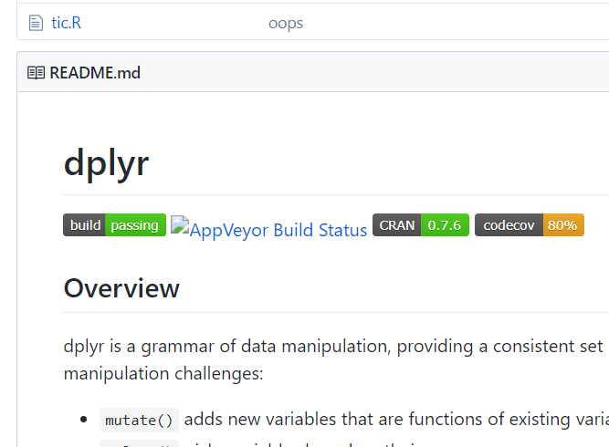
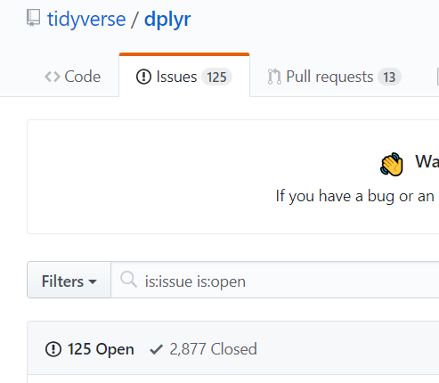

# Repo History

One benefit of version control is the ability to trace back the history of changes in your code. In this section we will try out a couple of options for exploring repository history.

- [ ] Inspect repo history on Github
- [ ] LICENSE.md, Contributor guidelines
- [ ] Inspect repo history with Git-GUI and gitk
- [ ] Git history: diffs, blames, branches

## Expore Repo History on Github

Choose an existing repo with some history. It could be [this repository](https://github.com/USEPA/Git-GitHub-Bitbucket_Workshop_2019) or maybe the Github repository for a Python or R package that you have used in the past. Maybe: 

* [dplyr](https://github.com/tidyverse/dplyr) or 
* [pandas](https://github.com/pandas-dev/pandas)

The repository page has tons of information. You can explore the current code, see what bugs have been reported in the code, and what changes have been suggested by the community.

Since the README file is used as the home page for a repo on Github, this is frequently the place to go to learn about a piece of software you haven't used before.

Expand steps & screenshots for exploring history on Github

### Browsing Code

Navigate into a code folder and open up a code file.

Reading well-written code can be a great way to improve your own programming, particularly when you want your code to function like other projects that you have seen.

Github offers may different ways to explore the history of an individual code file. In the upper right should be some different views of the file you are browsing.

Explore the Raw, Blame, and History views -- what are they showing?

### Issues

Are you having trouble using a package? Maybe someone else is having a similar problem and has requested a fix. From the repository home, go to the `issues` tab.

You can search through open or closed issues, and see what discussion there has been around solutions so far.

(note: new repos won't have issues -- take a look at a widely used one. The repo for the [Atom](https://github.com/atom/atom) text editor has > 600 isssues, for example)

### Pull requests

Some open source projects attract a lot of users contributing code improvements. You can take a look at proposed changes users have suggested on Github. Open the `pull requests` tab

## Extras: LICENSE.md, CONTRIBUTING.md, codes of conduct, etc

Some questions that come up when working on open-source code are:
1) What license should I use?
2) What guidance should I provide to potential contributors to the project?
3) What about a code of conduct?

Addressing what EPA needs for all of these is beyond the scope here, but while we are browsing repos, take a look at how other projects have addressed these questions.

For example:
* dplyr's [license](https://github.com/tidyverse/dplyr/blob/master/LICENSE.md), [contributor guidelines](https://github.com/tidyverse/dplyr/blob/master/.github/CONTRIBUTING.md), [code of conduct](https://github.com/tidyverse/dplyr/blob/master/.github/CODE_OF_CONDUCT.md), and [issue template](https://github.com/tidyverse/dplyr/blob/master/.github/ISSUE_TEMPLATE.md)
* panda's [.github folder](https://github.com/pandas-dev/pandas/tree/master/.github) has many of these same items. It also has an extensive [contributing guide](https://pandas.pydata.org/pandas-docs/stable/contributing.html) linked from the README.

The main folder of a repo or the `.github` folder are common places to find these files.

Here is an [article from Github about contributor guidelines](https://help.github.com/articles/setting-guidelines-for-repository-contributors/)

## Explore Repo History with Git-GUI

Github is great, but you can also explore repo history locally. When you clone a repo, you are getting the entire history of the repo. This is an area where visual tools really shine compared to the command line.

Expand it!

### Clone an existing repo locally

Follow the same approach [as before](02-practice.md).

e.g.:
    git clone https://github.com/tidyverse/dplyr.git
    
(we will see if this stresses the internet connection too much....)

### Open the Repo in Git-GUI

### Inspect Commit Graph

Under the 'repository' menu, go to 'visualize master's history' (the main branch of code is usually called master)

Looks something like this:

If you squint, you can sort of imagine how this relates to what you could see on Github, but not quite the same. More modern git clients offer better visualization.

This page shows some screenshots of what [this sort of thing looks like in GitKraken](https://support.gitkraken.com/working-with-commits/diff).

## Git History: diffs, blames, branches

It is possible to explore diffs, blames, branches, commits, etc, all from the command line. I have to admit I don't have much experience with this, but you could try out:

This [article from Atlassian](https://www.atlassian.com/git/tutorials/inspecting-a-repository/git-blame) goes through some commands you can try.

This is an area where a GUI really shines. 

___
[Return to Section 3 - Collaboration workflows](03-collaboration.md)
[Proceed to Section 5 - Git automation](05-automation.md)

