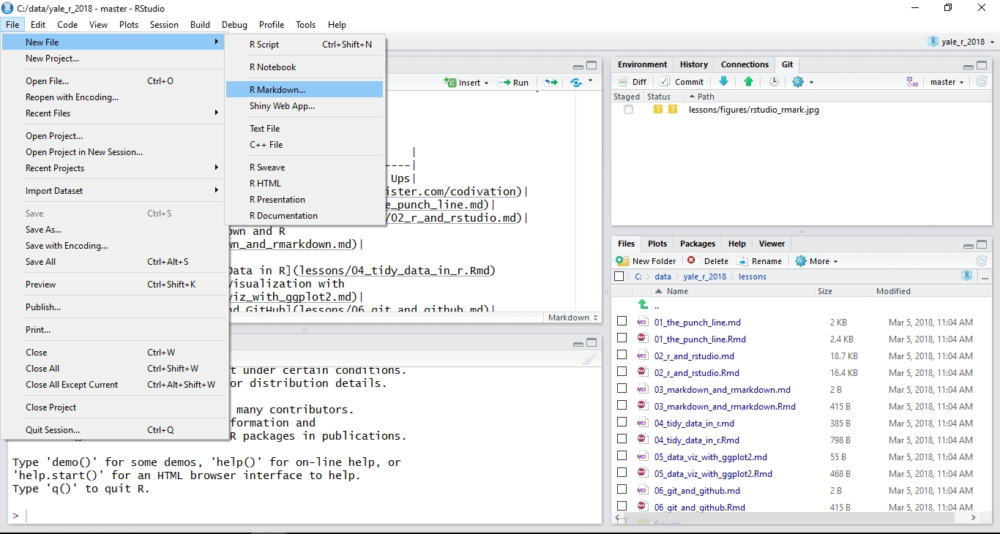
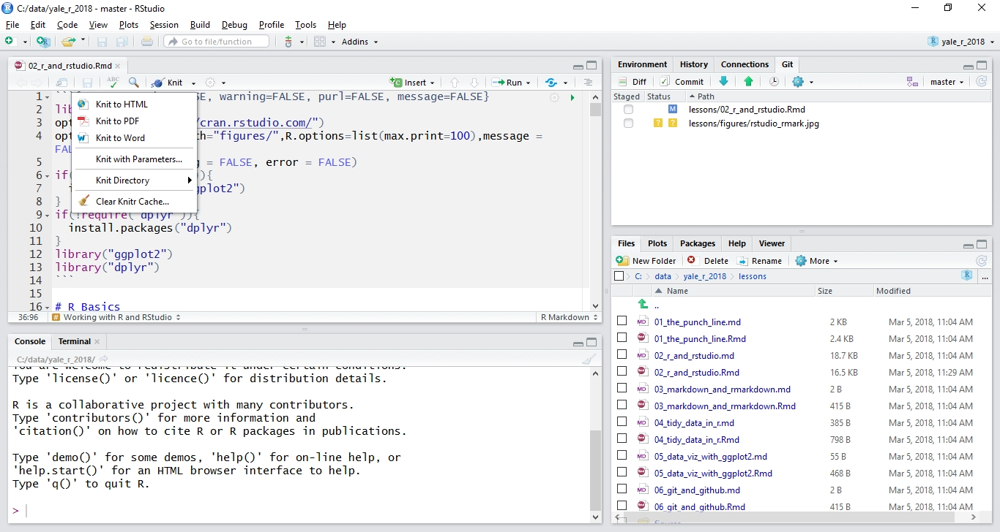

# RStudio

In this first lesson we are going to go over the very basics of using RStudio.  We need to do this so we can jump into our example.

## Lesson Outline:

- [Working with RStudio](#working-with-rstudio)

## Lesson Exercises:
- [Exercise 1.1](#exercise-11)

## Working with RStudio
Over the last several years, RStudio has become a very popular IDE (integrated development environment) for R. In addition to interacting with the R Console, RStudio has many extras built in including version control integration, package building, reproducible research, de-bugging, and built-in text editor with smart highlighting and code completion.  This is the environment we will be using for the workshop and should set you up for continued learning with R.

Before we get to the first exercise, let's spend a bit of time working with RStudio.  You can follow along on your own machines as we try different things with RStudio.

### Fire up R and RStudio
Find the RStudio shortcut or menu (OS specific of course) and fire it up.  Once done, it should look something like:

Let's take some time to look around.  I'll show each of the different sections, or "panes" as they are known.

### Projects

Projects are a way to organize your work in RStudio.  Essentially they are folders, but with a few added files so that you can manage some options on a per project basis.  To create a new project use File:New Project, or use the drop-down on the top right of the RStudio window.  It will look like this after you select "New Project..."

### Source, Scripts, and R Markdown

The source you work on will usually be in scripts (i.e., text files that hold the code you write), or in our case R Markdown files (`.Rmd`) that hold code, documentation, etc.  We will work with our `.Rmd` files and the console during this workshop.  To create a new R Markdown File you use "File:New File:R Markdown".

### Interacting with R inside of RStudio

Once you have text and code in your R Markdown file, they still need to be sent to the R console or rendered.  There are several ways to do this.  There is the old stand-by of copying and pasting, but this is a bit cumbersome.  Instead you can use the `Run` menu in the upper right corner of the source pane, or even better (I think so, anyway) you can use `ctrl-enter`.  Both the `Run` buttons and `ctrl-enter` will send the line that your cursor is on and move to the next line or it will send just the selected text. When working with R Markdown files we usually want to render those to an output format such as html or pdf.  Again, there are several ways to do that.  The easiest is it use the `knit button` near the upper left of your source pane.

## Exercise 1.1

Now that we have RStudio opened and know are way around a bit, we are going to jump straight to the end and see what an R Markdown file looks like, render it and be amazed!  This is kind of like telling a joke by starting with the punch line first!

1. Follow the link to [The Punch Line](punchline.md) and we will work through that together to get more familar with R Studio, R Markdown, and R. 

