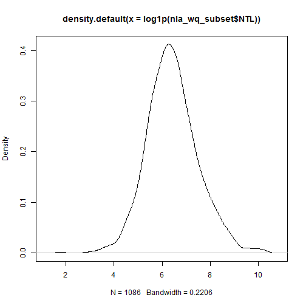
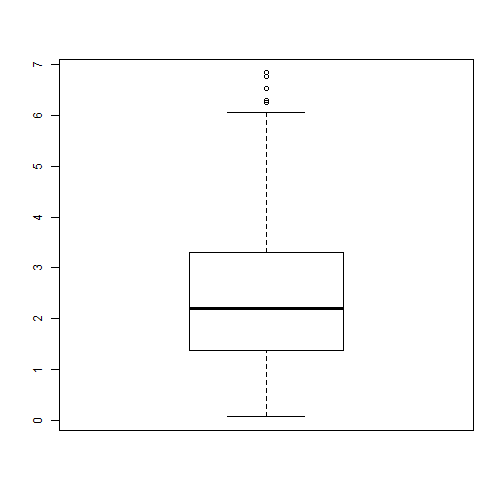

# Basic Data analysis with R

This lesson will cover calculating basic statistics with R, conducting statistical tests, building simple linear models, and if there is time, we can talk a bit about `randomForest` .  We will continue to use the 2007 NLA data for the examples (e.g. `nla_wq_subset`)

## Lesson Outline:

- [Basic Statistics](#basic-statist)
- [Data visualization for data analysis](#data-visualization-for-data-analysis)
- [Some tests: t-test and ANOVA](#some-tests-ttest-and-anova)
- [Correlations and Linear modeling](#correlations-and-linear-modeling)
- [Random Forest](#random-forest)

## Lesson Exercises:
- [Exercise 6.1](#exercise-61)
- [Exercise 6.2](#exercise-62)
- [Exercise 6.3](#exercise-63)

## Basic Statistics

First step in analyzing a dataset like this is going to be to dig through some basic statistics as well as some basic plots.  

We can get a summary of the full data frame:


```r
#Get a summary of the data frame
summary(nla_wq_subset)
```

```
##    SITE_ID             RT_NLA            EPA_REG         
##  Length:1086        Length:1086        Length:1086       
##  Class :character   Class :character   Class :character  
##  Mode  :character   Mode  :character   Mode  :character  
##                                                          
##                                                          
##                                                          
##    WSA_ECO9         LAKE_ORIGIN             PTL               NTL         
##  Length:1086        Length:1086        Min.   :   1.00   Min.   :    5.0  
##  Class :character   Class :character   1st Qu.:  10.00   1st Qu.:  309.5  
##  Mode  :character   Mode  :character   Median :  25.50   Median :  575.0  
##                                        Mean   : 109.22   Mean   : 1175.8  
##                                        3rd Qu.:  89.75   3rd Qu.: 1172.0  
##                                        Max.   :4679.00   Max.   :26100.0  
##       CHLA           SECMEAN      
##  Min.   :  0.07   Min.   : 0.040  
##  1st Qu.:  2.98   1st Qu.: 0.650  
##  Median :  8.02   Median : 1.380  
##  Mean   : 29.38   Mean   : 2.195  
##  3rd Qu.: 26.08   3rd Qu.: 2.850  
##  Max.   :936.00   Max.   :36.710
```

Or, we can pick and choose what stats we want.  For instance:


```r
#Stats for Total Nitrogen
mean(nla_wq_subset$NTL)
```

```
## [1] 1175.79
```

```r
median(nla_wq_subset$NTL)
```

```
## [1] 575
```

```r
min(nla_wq_subset$NTL)
```

```
## [1] 5
```

```r
max(nla_wq_subset$NTL)
```

```
## [1] 26100
```

```r
sd(nla_wq_subset$NTL)
```

```
## [1] 2200.842
```

```r
IQR(nla_wq_subset$NTL)
```

```
## [1] 862.5
```

```r
range(nla_wq_subset$NTL)
```

```
## [1]     5 26100
```

In these cases we took care of our NA values during our data clean up, but there may be reasons you would not want to do that.  If you retained NA values, you would need to think about how to handle those.  One way is to remove it from the calculation of the statistics using the `na.rm = TRUE` argument.  For instance:


```r
#An example with NA's
x <- c(37,22,NA,41,19)
mean(x) #Returns NA
```

```
## [1] NA
```

```r
mean(x, na.rm = TRUE) #Returns mean of 37, 22, 41, and 19
```

```
## [1] 29.75
```

It is also useful to be able to return some basic counts for different groups.  For instance, how many lakes in the NLA were natural and how many were man made.


```r
#The table() funciton is usefule for returning counts
table(nla_wq_subset$LAKE_ORIGIN)
```

```
## 
## MAN-MADE  NATURAL 
##      611      475
```

The `table()` function is also useful for looking at multiple columns at once.  A contrived example of that:


```r
x <- c(1,1,0,0,1,1,0,0,1,0,1,1)
y <- c(1,1,0,0,1,0,1,0,1,0,0,0)
xy_tab <- table(x,y)
xy_tab
```

```
##    y
## x   0 1
##   0 4 1
##   1 3 4
```

```r
prop.table(xy_tab)
```

```
##    y
## x            0          1
##   0 0.33333333 0.08333333
##   1 0.25000000 0.33333333
```

Lastly, we can use what we learned in the [data aggregation](data_aggregation.md#using-groups-to-summarize-data) lesson and can combine these with some `dplyr` and get summary stats for groups.  


```r
orig_stats_ntl <- nla_wq_subset %>%
  group_by(LAKE_ORIGIN) %>%
  summarize(mean_ntl = mean(NTL),
            median_ntl = median(NTL),
            sd_ntl = sd(NTL))
orig_stats_ntl
```

```
## # A tibble: 2 × 4
##   LAKE_ORIGIN  mean_ntl median_ntl   sd_ntl
##         <chr>     <dbl>      <int>    <dbl>
## 1    MAN-MADE  825.3617        531  939.357
## 2     NATURAL 1626.5516        624 3096.758
```

And, just because it is cool, a markdown table!


|LAKE_ORIGIN |  mean_ntl| median_ntl|   sd_ntl|
|:-----------|---------:|----------:|--------:|
|MAN-MADE    |  825.3617|        531|  939.357|
|NATURAL     | 1626.5516|        624| 3096.758|

which renders in html to something like,


|LAKE_ORIGIN |  mean_ntl| median_ntl|   sd_ntl|
|:-----------|---------:|----------:|--------:|
|MAN-MADE    |  825.3617|        531|  939.357|
|NATURAL     | 1626.5516|        624| 3096.758|

## Exercise 6.1
1. Look at some of the basic stats for other columns in our data.  What is the standard deviation for PTL?  What is the median Secchi depth?  Play around with others.
2. Using some `dplyr` magic, let's look at mean Secchi by reference class (RT_NLA). 
3. The `quantile()` function allows greater control over getting different quantiles of your data.  For instance you can use it to get the min, median and max with `quantile(nla_wq_subset$NTL, probs = c(0,0.5,1))`.  Re-write this to return the 33rd and 66th quantiles.

## Data visualization for data analysis

While we have already covered visualization and talked about these, I wanted to include them here as they really are an integral part of exploratory data analysis. In particular distributions and bi-variate relationships are better displayed graphically.  

We can look at histograms and density:


```r
#A single histogram using base
hist(nla_wq_subset$NTL)
```


```r
#Log transform it
hist(log1p(nla_wq_subset$NTL)) #log1p adds one to deal with zeros
```


```r
#Density plot
plot(density(log1p(nla_wq_subset$NTL)))
```



And boxplots:


```r
#Simple boxplots
boxplot(nla_wq_subset$CHLA)
```


```r
boxplot(log1p(nla_wq_subset$CHLA))
```



```r
#Boxplots per group
boxplot(log1p(nla_wq_subset$CHLA)~nla_wq_subset$EPA_REG)
```


And scatterplots:


```r
#A single scatterplot
plot(log1p(nla_wq_subset$PTL),log1p(nla_wq_subset$CHLA))
```


```r
#A matrix of scatterplot
plot(log1p(nla_wq_subset[,6:9]))
```


Lastly, it might be nice to look at these on a per variable basis or on some grouping variable. First we could look at the density of each measured variable. This requires some manipulation of the data which will allow us to use facets in ggplot to create a density distribution for each of the variables.


