# Data Visualization

Visualizing  data is an area where R really shines.  For this we will split our focus between base and an installed package, `ggplot2`.  I will show some quick and easy graphics that we can produce with base R, but we won't spend anytime customizing them. Instead, we will move on quickly to `ggplot2`, which is now (I have no data to back this up), the de-facto standard for visualizing data in R.  We have only a very short time to spend on this, but hopefully it will provide enough of a foundation for future learning.

## Lesson Outline:

- [Simple plots with base R](#simple-plots-with-base-r)
- [Introduction to `ggplot2`](#introduction-to-ggplot2)
- [Customizing `ggplot2` plots](#customizing-ggplot2-plots)
- [Cool stuff and getting help with `ggplot2`](#cool-stuff-and-getting-help-with-ggplot2)

## Lesson Exercises:
- [Exercise 4.1](#exercise-41)

## Some examples for inspiration!
Before we get started, I do like to show what is possible.  A couple of geospatial examples of maps created in R.

A few (now somewhat dated) examples of maps built with R show this:


##Simple plots with base R
When you first get a dataset and are just starting to explore it, you want do be able to quickly visualize different bits and pieces about the data.  I tend to do this, initially, with base R. We will cover some quick plots with base R.  Later we are going to go into more detail on `ggplot2` which is becoming the gold standard of viz in R.  For now we will look at some of the simple, yet very useful, plots that come with base R.  

The workhorse function for plotting data in R is `plot()`.  With this one command you can create almost any plot you can conceive of, but for this workshop we are just going to look at the very basics of the function.  The most common way to use `plot()` is for scatterplots.  Let's look at some scatterplots of the NLA data.


```r
plot(nla_wq$CHLA,nla_wq$NTL)
```


Hey, a plot!  Not bad.  Let's customize a bit because those axis labels aren't terribly useful and we need a title. For that we can use the `main`, `xlab`, and `ylab` arguments.


```r
plot(nla_wq$CHLA,nla_wq$NTL,main="NLA Nutrient and Chlorophyll",
     xlab="Chlorophyll a",ylab="Total Nitrogen")
```


Now, let's look at boxplots and histograms.

Two great ways to use boxplots are straight up and then by groups. For this we will use `boxplot()` and in this case it is looking for a vector as input.


```r
boxplot(nla_wq$CHLA)
```


As plots go, well, um, not great.  Let's try it with a bit more info and create a boxplot for each of the groups.  This is using formula notation which is in the base form of `y ~ x`.  Thinking about this form a 2-dimensional plot standpoint it makes sense as your x-axis is the group and y is the value of interest.  We will use a log transformation for this.  And a quick note on logs in R, the `log()` function provides this and has to arguments.  The first is the vector of numeric values you wish to transfrom, and the second is the base.  Default base for `log()` is the the natural log.  A convenience function `log10()` is the equivalent of doing `log(100,base=10)`.  We will use `log10()` for these examples.


```r
boxplot(nla_wq$CHLA ~ nla_wq$EPA_REG)
```


```r
#Given the spread, maybe  a log transform makes sense
boxplot(log10(nla_wq$CHLA) ~ nla_wq$EPA_REG)
```

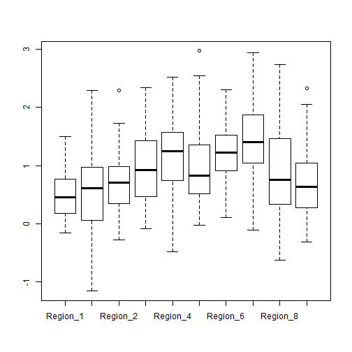

And finally, histograms.


```r
hist(nla_wq$PTL)
```


```r
#And log again specifying number of breaks (e.g. bins)
hist(log10(nla_wq$PTL), breaks=10)
```


##Introduction to `ggplot2`

More can certainly be done with base graphics, but, assuming we have time, we will move to `ggplot2` for some more complex plotting.  If you are interested, there has been some interesting back and forth on `ggplot2` versus base.  Read [here for the base case](http://simplystatistics.org/2016/02/11/why-i-dont-use-ggplot2/) and [here for the `ggplot2` case](http://varianceexplained.org/r/why-I-use-ggplot2/).  In short, to each their own!  For me, I am mostly team `ggplot2`.

A lot has been written and discussed about `ggplot2`.  In particular see [here](http://ggplot2.org/), [here](http://docs.ggplot2.org/current/) and [here](https://github.com/karthikram/ggplot-lecture).  The gist of all this, is that `ggplot2` is an implementation of something known as the "grammar of graphics."  This separates the basic components of a graphic into distinct parts (e.g. like the parts of speech in a sentence).  You add these parts together and get a figure.

Before we start developing some graphics, we need to do a bit of package maintenance as `ggplot2` is not installed by default.


```r
install.packages("ggplot2")
library("ggplot2")
```

First thing we need to do is to create our ggplot object.  Everything we do will build off of this object.  The bare minimum for this is the data (handily, `ggplot()` is expecting a data frame) and `aes()`, or the aesthetics layers.  Oddly (at least to me), this is the main place you specify your x and y data values.


```r
# aes() are the "aesthetics" info.  When you simply add the x and y
# that can seem a bit of a confusing term.  You also use aes() to 
# change color, shape, size etc. of some items 
nla_gg<-ggplot(nla_wq,aes(x=CHLA,y=NTL))
```

Great, nothing happened...  All we did at this point is create an object that contains our data and what we want on the x and y axes.  We haven't said anything about what type of plot we want to make.  That comes next with the use of geometries or `geom_`'s.  

So if we want to simply plot points we can add that geometry to the ggplot object.  

A side note on syntax.  You will notice that we add new "things" to a ggplot object by adding new functions.  In concept this is very similar to the piping we talked about earlier.  Essentially it takes the output from the first function as the input to the second.  So to add points and create the plot, we would do:


```r
#Different syntax than you are used to
nla_gg + 
  geom_point()
```

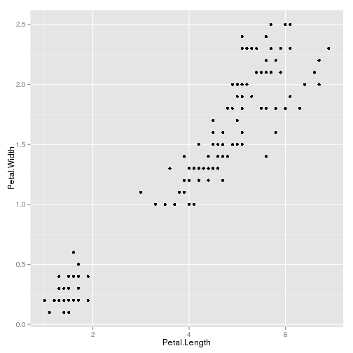

```r
#This too can be saved to an object
nla_scatter<-nla_gg +
                geom_point()

#Call it to create the plot
nla_scatter
```


Not appreciably better than base, in my opinion.  But what if we want to add some stuff...

First a title and some axes labels.  These are part of `labs()`.


```r
#Getting fancy to show italics and greek symbols
x_lab <- expression(paste("Chlorophyll ",italic(a), " (", mu, "g/L)"))
y_lab <- expression(paste("Total Nitrogen ", "(", mu, "g/L)"))
nla_scatter<-nla_scatter +
                labs(title="Nitrogen and Chlorophyll in US Lakes",
                     x=x_lab, y=y_lab)
nla_scatter
```

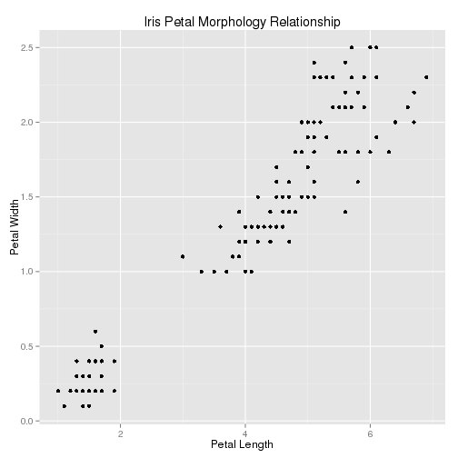

Now to add some colors, shapes etc to the point.  Look at the `geom_point()` documentation for this.


```r
nla_scatter<- nla_scatter +
                geom_point(aes(color=RT_NLA, shape=RT_NLA),size=2)
nla_scatter
```

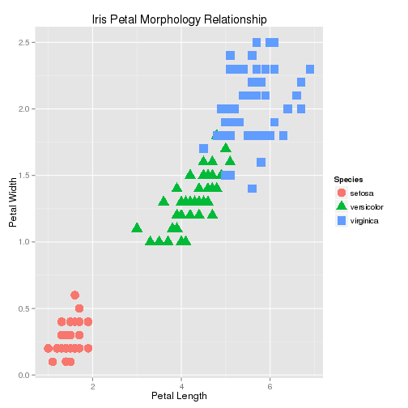

You'll notice we used `aes()` again, but this time inside of the geometry.  This tells ggplot2 that this aes only applies to the points.  Other geometeries will not be affected by this.

In short, this is much easier than using base.  Now `ggplot2` really shines when you want to add stats (regression lines, intervals, etc.). 

Lets add a loess line with 95% confidence intervals


```r
nla_scatter_loess<-nla_scatter +
                geom_smooth()
nla_scatter_loess
```

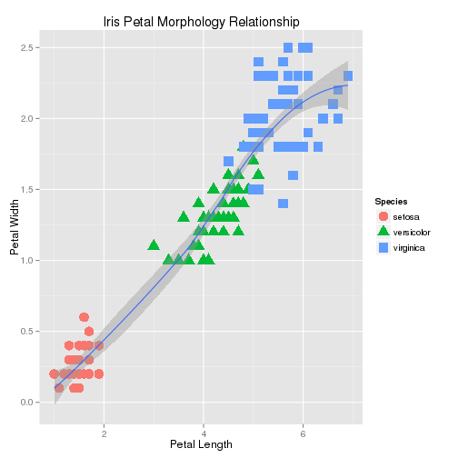

Try that in `base` with so little code!

Or we could add a simple linear regression line with:


```r
nla_scatter_lm<-nla_scatter +
                  geom_smooth(method="lm")
nla_scatter_lm
```


And if we are interested in the regressions by group we could do it this way.


```r
nla_scatter_lm_group<-nla_scatter +
                        geom_smooth(method="lm", 
                                    aes(group=RT_NLA))
nla_scatter_lm_group
```

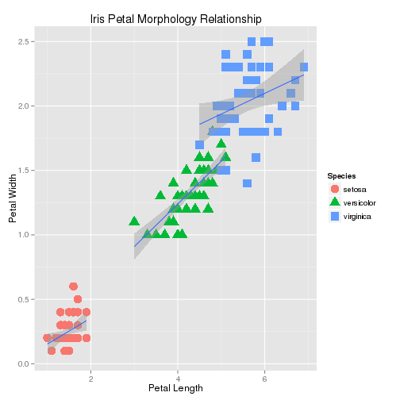

Or, if we wanted our regression lines to match the color.


```r
nla_scatter_lm_color<-nla_scatter +
                        geom_smooth(method="lm", 
                                    aes(color=RT_NLA))
nla_scatter_lm_color
```

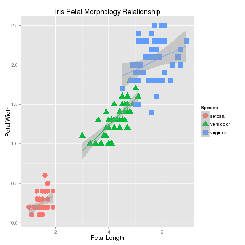


Notice, that we specified the `aes()` again, but for `geom_smooth()`.  We only specified the x and y in the original `ggplot` object, so if want to do something different in the subsequent functions we need to overwrite it for the function in which we want a different mapping (i.e. groups).

In short, some of the initial setup for ggplot is a bit more verbose than base R, but when we want to do some more complex plots it is much easier in `ggplot2`.  

Before we get into another exercise, lets look at some of the other geometries.  In particular, boxplots and histograms.  If you want to see all that you can do, take a look at the list of `ggplot2` [geom functions](http://docs.ggplot2.org/current/).


###Boxplots
Boxplots will require us to specify only a single variable to plot.  A simple example would look like 


```r
ggplot(nla_wq,aes(x=EPA_REG,y=log10(CHLA))) +
  geom_boxplot()
```

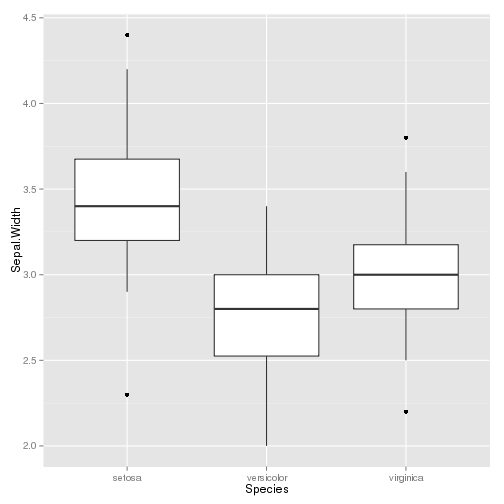

###Histograms


```r
ggplot(nla_wq,aes(x=log10(CHLA)))+
  geom_histogram(binwidth=0.25)
```

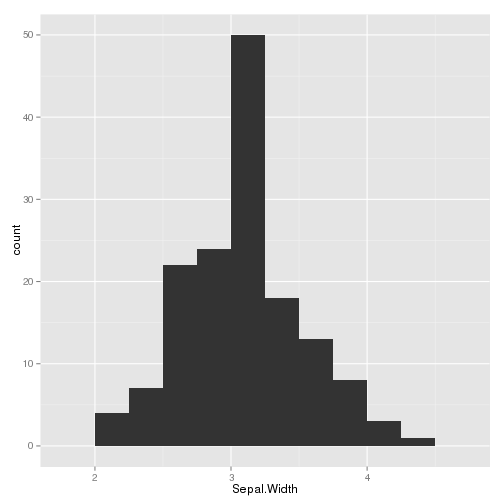

##Exercise 4.1
Let's now build some plots with `ggplot2`

1. Add this code to your `nla_analysis.R` script.

2. Try out a simple scatterplot, boxplot, and histogram on any of the data in our `nla_data` data frame.

3. Lastly, build a scatter plot showing the relationship between PTL and CHLA (`log10()` transform both) with each LAKE_ORIGIN value a different color.  For some optional fun add in a regression line for each value of LAKE_ORIGIN.

##Customizing `ggplot2` plots
I don't expect us to have time to go through the customization, but I wnated to provide some examples for future reading.   

###Themes
I am certain there are some opinions (good and bad) about the default look and feel of a `ggplot2` plot.  Personally, I think  it is an improvement over `base`, but generally not what I want for my plots.  The `theme()` function (and related functions), give us the ability to completely customize the plot.  A great place to start with this is the [themes vignette](http://docs.ggplot2.org/dev/vignettes/themes.html) within `ggplot2`  We could spend a whole day just on this, so for this class we are going to look at the very basics and then use some of the canned themes.

Let's first create a simple scatterplot.


```r
scatter_p<-ggplot(nla_wq,aes(x=log10(PTL),y=log10(CHLA))) +
              geom_point(aes(colour=LAKE_ORIGIN, shape=LAKE_ORIGIN))
scatter_p
```

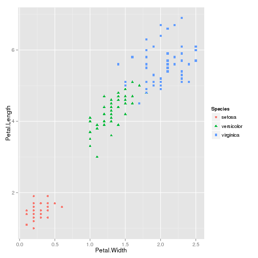

Nothing new there.  Let's now edit some of this theme by dropping the grey background and the grid, and changing our font.


```r
scatter_p_base<-scatter_p + 
  theme(panel.background = element_blank(), 
        panel.grid = element_blank(),
        panel.border = element_rect(fill = NA),
        text=element_text(family="serif",colour="red",size=24))
scatter_p_base
```

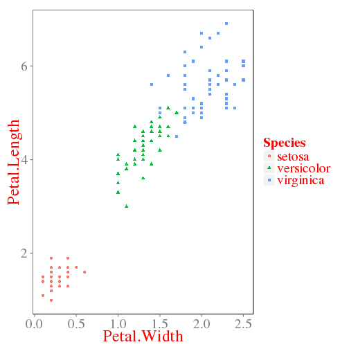

Still not great, but it shows the basics.  You can build on this and edit EVERYTHING in the plot.  To get an idea of what you have access to, take a look at the help on `theme()` (e.g. `help("theme")`).

There are a few alterantive themes available by default (use `help("ggtheme")`) that save some time and typing.  Let's look at two.


```r
scatter_p + theme_bw()
```

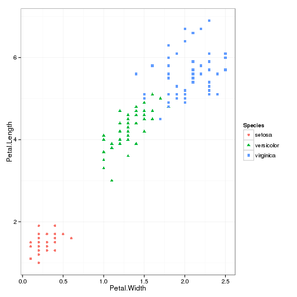

```r
scatter_p + theme_classic()
```

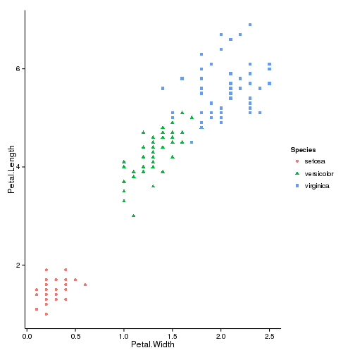

Let's build on one of these and try to create a more polished plot.  We will start from scratch and add in some custom colors too.


```r
#Now Let's start over, with some new colors and regression lines
x_lab <- expression(paste("Chlorophyll ",italic(a), " (", mu, "g/L)"))
y_lab <- expression(paste("Total Nitrogen ", "(", mu, "g/L)"))
scatter_polished <- ggplot(nla_wq,aes(x=log10(PTL),y=log10(CHLA))) +
              geom_point(aes(colour=RT_NLA, shape=RT_NLA)) +
              stat_smooth(method="lm", aes(colour=RT_NLA)) +
              scale_colour_manual(breaks = nla_wq$RT_NLA,
                                  values= c("steelblue1",
                                            "sienna",
                                            "springgreen3")) + 
              theme_classic(18,"Times") +
              theme(text=element_text(colour="slategray")) +
              labs(title="National \n Lake P and Chl a \n Relationship",
                     x=x_lab, y=y_lab)
              

scatter_polished 
```

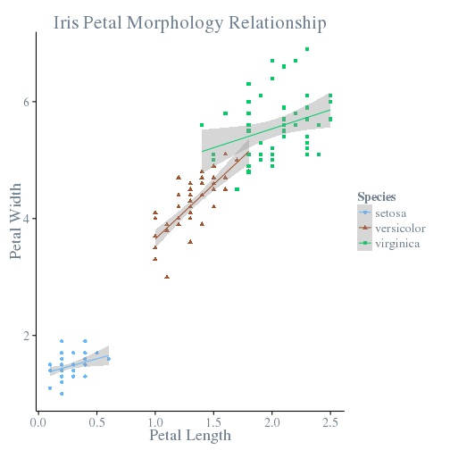

A bit complicated for some of the custom stuff, but that is the price you have to pay to get complete control over the output.  Last thing we probably want to do now is to save the plot.  Since we have our plot as a `ggplot` object we can use the `ggsave()` function.


```r
#Save as jpg, with 600dpi, and set width and height
#Many other options in the help
ggsave(plot=scatter_polished,
       file="Fig1.jpg",dpi=600,width=8, heigh=5)
#Save as PDF
ggsave(plot=scatter_polished,
       file="Fig1.pdf")
```

##Cool stuff and getting help with `ggplot2`
In this last section we won't have an exercise, but I did want to show some other things that `ggplot2` can do and show some other functions that people have built on top of `ggplot2` that are pretty cool.  Lastly, I provide some links on more reading as well as some nice (and fun) data visualization galleries.

###Facets
First thing I want to show are facets.  Facets allow you to lay out multiple plots in a grid.  With a single facet the result is similar to what we already accomplished by coloring/sizing points based on a factor in the dataset, but it separates into different plots and we can easily add an additional factor to organize by column.  Looking at some of the examples provided with `facet_grid()` shows us how these can work.


```r
tp_chla <- ggplot(nla_wq,aes(x=log10(PTL),y=log10(CHLA))) + geom_point()

tp_chla + facet_grid(RT_NLA ~ .)
```

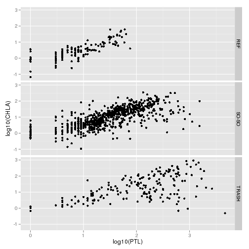

```r
tp_chla +
  stat_smooth() +
  facet_grid(RT_NLA ~ LAKE_ORIGIN)
```

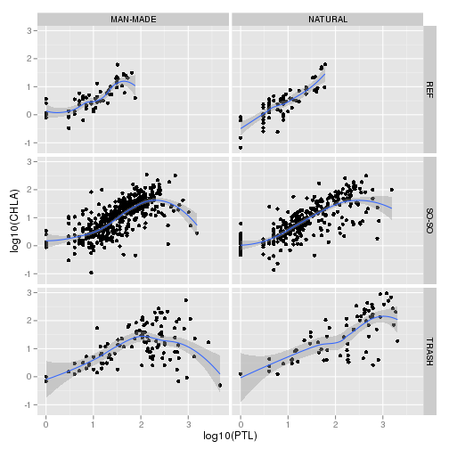

###Sources of Help on `ggplot2`
- [Winston Chang's Cookbook](http://www.cookbook-r.com/Graphs/): Many great step-by-step examples.  Good starting point for you own plots
- [Offical `ggplot2` documentation](http://docs.ggplot2.org/current/): The authoritative source.  Also many great examples.  The [aesthetics vignette](http://docs.ggplot2.org/current/vignettes/ggplot2-specs.html) is good to know about.

###R Data Viz Examples
- Cool rCharts examples: [rCharts Gallery](http://rcharts.io/gallery/)
- ggplot examples: [Google Image Search](http://goo.gl/P0q2Lx)
- R Data Viz, gone wrong:[Accidental aRt](http://accidental-art.tumblr.com) 
