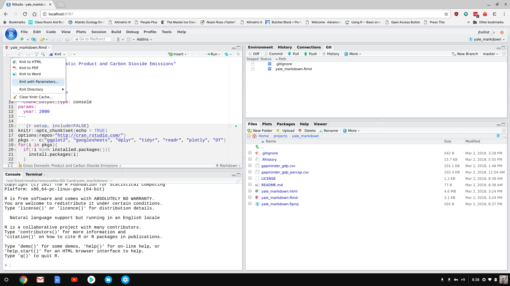

# The Punch Line First

For this workshop we are starting at the end and working backwards.  As such this first lesson is going to be in a follow the leader mode.  This is a useful way to teach this as we get to see what is possible early on and then we can focus on the details of how we get there and you will have a working example of a markdown document that includes a full data analysis.  Let's get started:

## Create a new project in RStudio

We will use the RStudio New Project dialog to create a new project to house our work for this workhsop GitHub.  In RStudio you need to find the New Project menu.

Then select "New Diectory"

Then select "New Project"

The select "Create Project."  At this point you should now have a new, empty project.  We need to download the R Markdown file and some data that we will be using for our workshop.  

- [Region 2 R Markdown Analysis](https://raw.githubusercontent.com/jhollist/region2_r/master/lessons/region2_nla_analysis.Rmd)
- [2007 NLA Water Quality Data](https://www.epa.gov/sites/production/files/2014-10/nla2007_chemical_conditionestimates_20091123.csv)

## Generate the html from your document

And now we can generate our output html by clicking on the "knit" button

