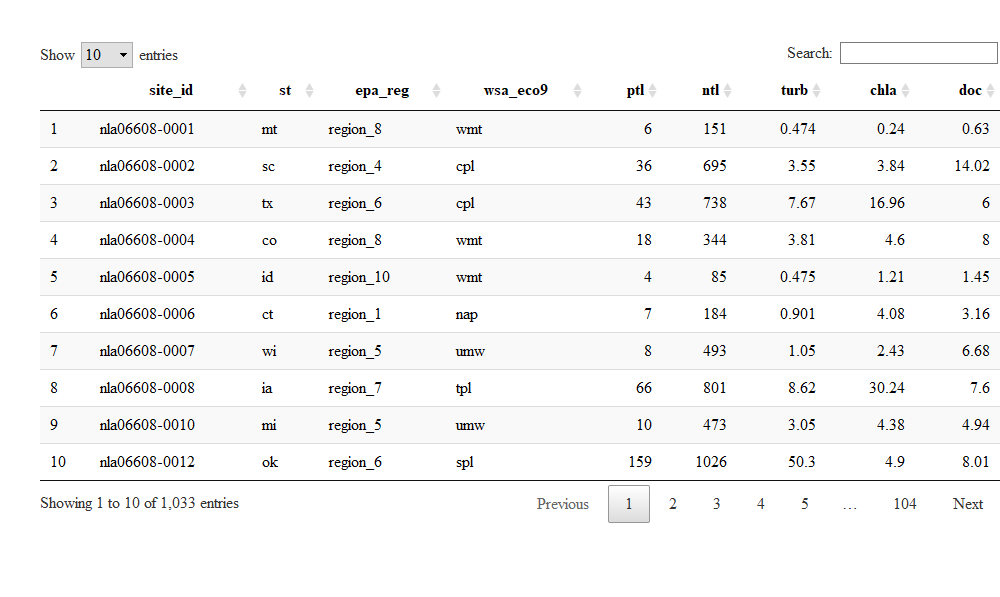
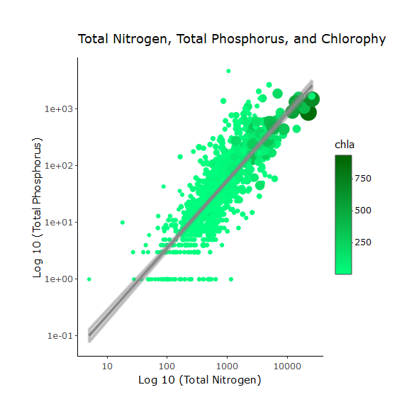

# 2007 NLA Analysis

# Purpose

The purpose of this document is to serve as motivating example (i.e. R, Markdown, and Open data are cool!), but will also serve to structure the rest of this workshop in that we will see how to work with and visualize data in R, combine code and documentation with R Markdown, and introduce [The Tidyverse](https://tidyverse.org) which is an opinionated (but effective) way to think about organizing and analyzing data in R.

# The Example

We will be using data from the 2007 National Lakes Assessment data as it provides a nice water quality relevant example and I am quite familiar with it so I already know most of the issues we will run into with it! 

## Load packages

This chunk is fancier than it normally needs to be.  It checks to make sure that packages are installed and installs if they aren't then loads it up.


```r
knitr::opts_chunk$set(echo = TRUE)
options(repos="http://cran.rstudio.com/")
pkgs <- c("ggplot2", "dplyr", "readr", "plotly", "DT")
for(i in pkgs){
  if(!i %in% installed.packages()){
    install.packages(i)
  }
}
x<-lapply(pkgs, library, character.only = TRUE)
```

```
## 
## Attaching package: 'plotly'
```

```
## The following object is masked from 'package:ggplot2':
## 
##     last_plot
```

```
## The following object is masked from 'package:stats':
## 
##     filter
```

```
## The following object is masked from 'package:graphics':
## 
##     layout
```

The chunk you use to load pacakges will usually be simpler and look something like the following:   


```r
library(ggplot2)
library(dplyr)
library(readr)
library(plotly)
library(DT)
```

## Get Data 

The data we need is available from the National Aquatic Resource Survey's website

First we can get the dataset that we have saved as a `.csv` in this repository.


## Manipulate Data

Let's tidy up this dataset by turning all column names to lower case (Jeff likes it that way), convert all text in the dataset to lower case (again Jeff likes it like that way and it is kind of a hot mess otherwise), filter out just the probability samples and the first visits, and select a subset of columns.


```r
nla_wq <- nla_wq_all %>%
  rename_all(tolower) %>% #making all names lower case beucase they are a mess!
  mutate_if(is.character, tolower) %>%
  filter(site_type == "prob_lake",
         visit_no == 1) %>%
  select(site_id, st, epa_reg, wsa_eco9, ptl, ntl, turb, chla, doc)

datatable(nla_wq)
```



## Visualize Data

Next step is to visualize the data.  Let's look at the association between total nitrogen, total phosphorus, and chlorophyll *a*.  


```r
nla_tn_tp_chla_gg <- nla_wq %>%
  ggplot(aes(x=ntl,y=ptl)) +
  geom_point(aes(group = st, size=chla, color=chla)) +
  scale_x_log10() +
  scale_y_log10() +
  scale_color_continuous(low = "springgreen", high = "darkgreen") +
  geom_smooth(method = "lm", color = "grey50") +
  theme_classic() +
  labs(title = "Total Nitrogen, Total Phosphorus, and Chlorophyll Associations",
       x = "Log 10 (Total Nitrogen)",
       y = "Log 10 (Total Phosphorus)")
  
ggplotly(nla_tn_tp_chla_gg)
```




