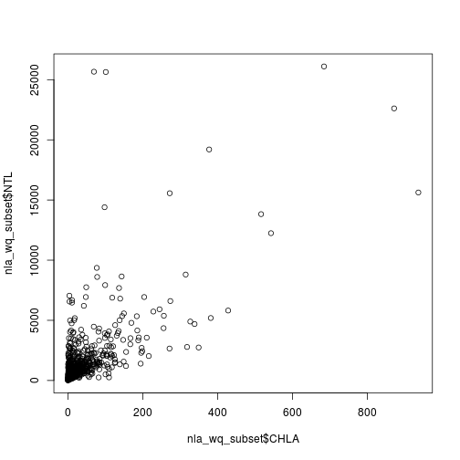
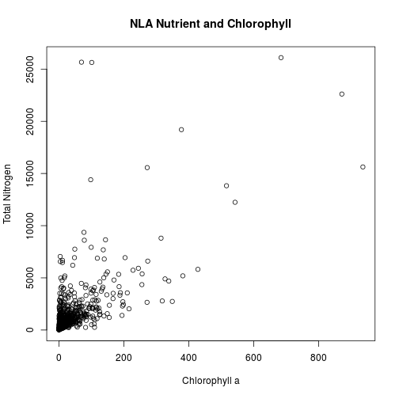
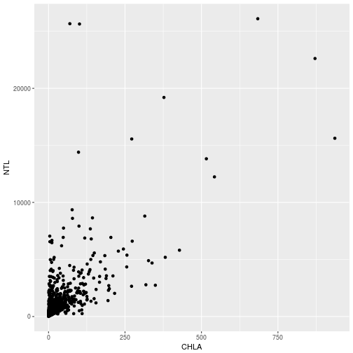
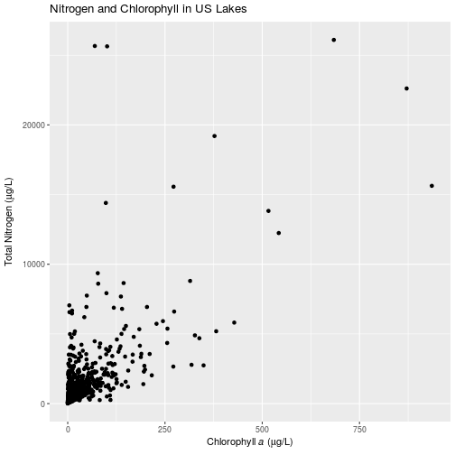
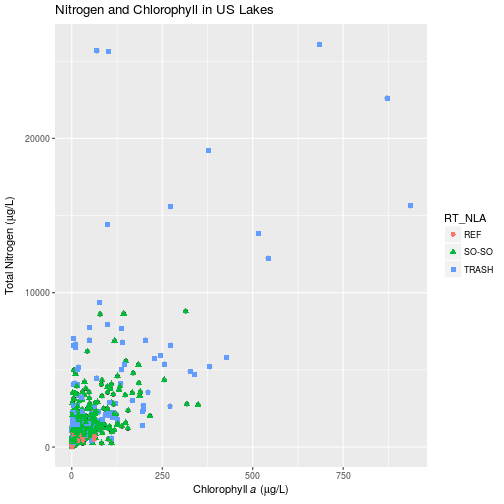
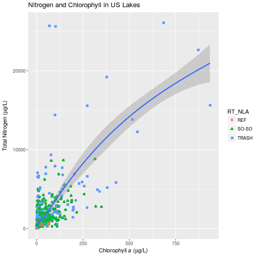
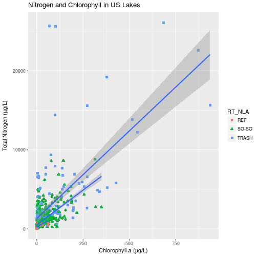
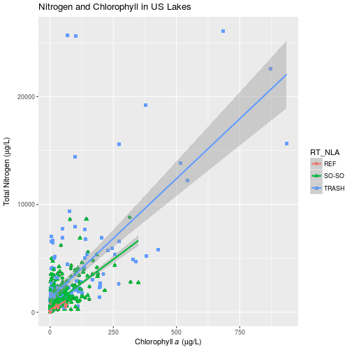

# Manipulating data frames and visualizing your data

Data wrangling (manipulation, jujitsu, cleaning, etc.) is the part of any data analysis that will take the most time.  While it may not necessarily be fun, it is foundational to all the work that follows.  For this workshop we are just going to cover the bare essentials of data wrangling in R and will see how to do this with Hadley Wickham's `dplyr` package.  We will also begin to do some basic data visualization.

## Lesson Outline:

- [`dplyr`](#dplyr)
- [Data Viz](#data-visualization)


## Lesson Exercises:
- [Exercise 1](#exercise-1)
- [Exercise 2](#exercise-2)
S
## dplyr

The package `dplyr` is a package that tries to provide easy tools for the most common data manipulation tasks.  It is built to work directly with data frames and this is one of the foundational packages in what is now known as the [tidyverse](https://tidyverse.org).  The thinking behind it was largely inspired by the package `plyr` which has been in use for some time but suffered from being slow in some cases.  `dplyr` addresses this by porting much of the computation to c++.  An additional feature is the ability to work with data stored directly in an external database.  The benefits of doing this are that the data can be managed natively in a relational database, queries can be conducted on that database, and only the results of the query returned.  

This addresses a common problem with R in that all operations are conducted in memory and thus the amount of data you can work with is limited by available memory.  The database connections essentially remove that limitation in that you can have a database of many 100s GB, conduct queries on it directly and pull back just what you need for analysis in R.  There is a lot of great info on `dplyr`.  If you have an interest, i'd encourage you to look more.  The vignettes are particulary good.

- [`dplyr` GitHub repo](https://github.com/hadley/dplyr)
- [CRAN page: vignettes here](http://cran.rstudio.com/web/packages/dplyr/)

### Using dplyr
So, base R can do what you need, but it is a bit complicated and the syntax is a bit dense (e.g. `iris[iris$Species == "versicolor",c(1,2,5)]`).  In `dplyr` this can be done with two functions, `select()` and `filter()`.  The code can be a bit more verbose, but it allows you to write code that is much more readable.  Before we start we need to make sure we've got everything installed and loaded.  If you do not have R Version 3.1.2 or greater you will have some problems (i.e. no `dplyr` for you).


```r
install.packages("dplyr")
library("dplyr")
```

Let's see how to select some columns and filter the results with `dplyr`. 


```r
#First, select some columns
dplyr_sel<-select(iris,Sepal.Length,Petal.Length,Species)
#That's it.  Select one or many columns
#Now select some, like before
dplyr_big_iris<-filter(iris, Petal.Length>=6)
head(dplyr_big_iris)
```

```
##   Sepal.Length Sepal.Width Petal.Length Petal.Width   Species
## 1          6.3         3.3          6.0         2.5 virginica
## 2          7.6         3.0          6.6         2.1 virginica
## 3          7.3         2.9          6.3         1.8 virginica
## 4          7.2         3.6          6.1         2.5 virginica
## 5          7.7         3.8          6.7         2.2 virginica
## 6          7.7         2.6          6.9         2.3 virginica
```

```r
#Or maybe we want just the virginica species
virginica_iris<-filter(iris,Species=="virginica")
head(virginica_iris)
```

```
##   Sepal.Length Sepal.Width Petal.Length Petal.Width   Species
## 1          6.3         3.3          6.0         2.5 virginica
## 2          5.8         2.7          5.1         1.9 virginica
## 3          7.1         3.0          5.9         2.1 virginica
## 4          6.3         2.9          5.6         1.8 virginica
## 5          6.5         3.0          5.8         2.2 virginica
## 6          7.6         3.0          6.6         2.1 virginica
```

```r
#And another way to look at these as a tibble
tbl_df(virginica_iris)
```

```
## # A tibble: 50 x 5
##    Sepal.Length Sepal.Width Petal.Length Petal.Width   Species
##           <dbl>       <dbl>        <dbl>       <dbl>    <fctr>
##  1          6.3         3.3          6.0         2.5 virginica
##  2          5.8         2.7          5.1         1.9 virginica
##  3          7.1         3.0          5.9         2.1 virginica
##  4          6.3         2.9          5.6         1.8 virginica
##  5          6.5         3.0          5.8         2.2 virginica
##  6          7.6         3.0          6.6         2.1 virginica
##  7          4.9         2.5          4.5         1.7 virginica
##  8          7.3         2.9          6.3         1.8 virginica
##  9          6.7         2.5          5.8         1.8 virginica
## 10          7.2         3.6          6.1         2.5 virginica
## # ... with 40 more rows
```

But what if I wanted to select and filter?  There are three ways to do this: use intermediate steps, nested functions, or pipes.  With the intermediate steps, you essentially create a temporary data frame and use that as input to the next function.  You can also nest functions (i.e. one function inside of another).  This is handy, but can be difficult to read if too many functions are nested as the process from inside out.  The last option, pipes, are a fairly recent addition to R.  Pipes in the unix/linux world are not new and allow you to chain commands together where the output of one command is the input to the next.  This provides a more natural way to read the commands in that they are executed in the way you conceptualize it and make the interpretation of the code a bit easier.  Pipes in R look like `%>%` and are made available via th `magrittr` package, which is installed as part of `dplyr`.  We will talk a bit about this, but the best desciption, by far, is the secion on pipes in the [R For Data Science](http://r4ds.had.co.nz/pipes.html) book.


Let's try all three with the same analysis: selecting out a subset of columns but for only a single species.


```r
#Intermediate data frames
#Select First: note the order of the output, neat too!
dplyr_big_iris_tmp1<-select(iris,Species,Sepal.Length,Petal.Length)
dplyr_big_iris_tmp<-filter(dplyr_big_iris_tmp1,Petal.Length>=6)
head(dplyr_big_iris_tmp)
```

```
##     Species Sepal.Length Petal.Length
## 1 virginica          6.3          6.0
## 2 virginica          7.6          6.6
## 3 virginica          7.3          6.3
## 4 virginica          7.2          6.1
## 5 virginica          7.7          6.7
## 6 virginica          7.7          6.9
```

```r
#Nested function
dplyr_big_iris_nest<-filter(select(iris,Species,Sepal.Length,Petal.Length),Species=="virginica")
head(dplyr_big_iris_nest)
```

```
##     Species Sepal.Length Petal.Length
## 1 virginica          6.3          6.0
## 2 virginica          5.8          5.1
## 3 virginica          7.1          5.9
## 4 virginica          6.3          5.6
## 5 virginica          6.5          5.8
## 6 virginica          7.6          6.6
```

```r
#Pipes
dplyr_big_iris_pipe<-select(iris,Species,Sepal.Length,Petal.Length) %>%
  filter(Species=="virginica")
head(dplyr_big_iris_pipe)
```

```
##     Species Sepal.Length Petal.Length
## 1 virginica          6.3          6.0
## 2 virginica          5.8          5.1
## 3 virginica          7.1          5.9
## 4 virginica          6.3          5.6
## 5 virginica          6.5          5.8
## 6 virginica          7.6          6.6
```

## Exercise 1
This exercise is going to focus on using what we just covered on `dplyr` to start to clean up the National Lakes Assessment data files.  Remember to use the stickies.

1. If it isn't already open, make sure you have the script we created, "nla_analysis.R" opened up.
2. Start a new section of code in this script by simply putting in a line or two of comments indicating what it is this set of code does.
3. Our goal for this is to create a new data frame that represents a subset of the observations as well as a subset of the columns. 
4. We want a selction of columns from the water quality data, `nla_wq`, stored in a new data frame calles `nla_wq_subset`.  The columns we want for this are: SITE_ID, VISIT_NO, SITE_TYPE, ST, EPA_REG, LAKE_ORIGIN, WSA_ECO9, TURB, NTL, PTL, and CHLA. 
6. Last thing we are going to need to do is get a subset of the observations.  We need only the lakes with VISIT_NO equal to 1 and SITE_TYPE equal to "PROB_Lake".  Keep the same name, `nla_wq_subset`, for this data frame.

# Data Visualization

Visualizing  data is an area where R really shines.  For this we will split our focus between base and an installed package, `ggplot2`.  I will show some quick and easy graphics that we can produce with base R, but we won't spend anytime customizing them. Instead, we will move on quickly to `ggplot2`, which is now (I have no data to back this up), the de-facto standard for visualizing data in R.  Given that `ggplot2` is general package for creating essentially ALL types of visualizations, it can seem quite complex (and it is).  What I hope you will get out of this section is a basic understanding of how to create a figure and, most importantly, how to find help and examples that you can build off of for your own visualizations.

## Some examples for inspiration!
Before we get started, I do like to show what is possible.  A couple of geospatial examples of maps created in R.

A few (now somewhat dated) examples of maps built with R show this:


And some fairly complicated figures:


And some cool examples using `ggplot2` with `plotly`.

<http://blog.revolutionanalytics.com/2014/11/3-d-plots-with-plotly.html>

Lastly, so that you know that there are many (often cool) mistakes that lead up to a final visualization there is [Accidental aRt](http://accidental-art.tumblr.com/).  And for a specific example ...

This final figure from [Hollister et al. 2017](http://onlinelibrary.wiley.com/enhanced/figures/doi/10.1002/ecs2.1321#figure-viewer-ecs21321-fig-0011) had as one of its early iterations this ["psychadelic doughnut"](http://accidental-art.tumblr.com/post/96720455195/was-trying-to-mess-with-projections-in-ggplot)

(**ht to Anne Kuhn, my office mate, for the name**)

Now that we are sufficiently motivated, lets take a step back to the very basics.

## Simple plots with base R
When you first get a dataset and are just starting to explore it, you want do be able to quickly visualize different bits and pieces about the data.  I tend to do this, initially, with base R. We will cover some quick plots with base R.  Later we are going to go into more detail on `ggplot2` which is becoming the gold standard of viz in R.  For now we will look at some of the simple, yet very useful, plots that come with base R.  

The workhorse function for plotting data in R is `plot()`.  With this one command you can create almost any plot you can conceive of, but for this workshop we are just going to look at the very basics of the function.  The most common way to use `plot()` is for scatterplots.  Let's look at some scatterplots of the NLA data.


```r
plot(nla_wq_subset$CHLA,nla_wq_subset$NTL)
```



Hey, a plot!  Not bad.  Let's customize a bit because those axis labels aren't terribly useful and we need a title. For that we can use the `main`, `xlab`, and `ylab` arguments.


```r
plot(nla_wq_subset$CHLA,nla_wq_subset$NTL,main="NLA Nutrient and Chlorophyll",
     xlab="Chlorophyll a",ylab="Total Nitrogen")
```



## Introduction to `ggplot2`: scatterplot

More can certainly be done with base graphics, but we will move to `ggplot2` for our more complex plotting.  If you are interested, there has been some interesting back and forth on `ggplot2` versus base.  Read [here for the base case](http://simplystatistics.org/2016/02/11/why-i-dont-use-ggplot2/) and [here for the `ggplot2` case](http://varianceexplained.org/r/why-I-use-ggplot2/).  In short, to each their own!  For me, I am mostly team `ggplot2`.

A lot has been written and discussed about `ggplot2`.  In particular see [here](http://ggplot2.org/), [here](http://docs.ggplot2.org/current/) and [here](https://github.com/karthikram/ggplot-lecture).  The gist of all this, is that `ggplot2` is an implementation of something known as the "grammar of graphics."  This separates the basic components of a graphic into distinct parts (e.g. like the parts of speech in a sentence).  You add these parts together and get a figure.

Before we start developing some graphics, we need to do a bit of package maintenance as `ggplot2` is not installed by default.


```r
install.packages("ggplot2")
library("ggplot2")
```

First thing we need to do is to create our ggplot object.  Everything we do will build off of this object.  The bare minimum for this is the data (handily, `ggplot()` is expecting a data frame) and `aes()`, or the aesthetics layers.  Oddly (at least to me), this is the main place you specify your x and y data values.


```r
# aes() are the "aesthetics" info.  When you simply add the x and y
# that can seem a bit of a confusing term.  You also use aes() to 
# change color, shape, size etc. of some items 
nla_gg <- ggplot(nla_wq_subset,aes(x=CHLA,y=NTL))
```

Great, nothing happened...  All we did at this point is create an object that contains our data and what we want on the x and y axes.  We haven't said anything about what type of plot we want to make.  That comes next with the use of geometries or `geom_`'s.  

So if we want to simply plot points we can add that geometry to the ggplot object.  

A side note on syntax.  You will notice that we add new "things" to a ggplot object by adding new functions.  In concept this is very similar to the piping we talked about earlier.  Essentially it takes the output from the first function as the input to the second.  So to add points and create the plot, we would do:


```r
#Different syntax than you are used to
nla_gg + 
  geom_point()
```



```r
#This too can be saved to an object
nla_scatter <- nla_gg +
                geom_point()

#Call it to show the plot
nla_scatter
```


Not appreciably better than base, in my opinion.  But what if we want to add some stuff...

First a title and some axes labels.  These are part of `labs()`.


```r
#Getting fancy to show italics and greek symbols
x_lab <- expression(paste("Chlorophyll ",italic(a), " (", mu, "g/L)"))
y_lab <- expression(paste("Total Nitrogen ", "(", mu, "g/L)"))
nla_scatter <- nla_scatter +
                labs(title="Nitrogen and Chlorophyll in US Lakes",
                     x=x_lab, y=y_lab)
nla_scatter
```



Now to add some colors, shapes etc to the point.  Look at the `geom_point()` documentation for this.


```r
nla_scatter <-  nla_scatter +
                geom_point(aes(color=RT_NLA, shape=RT_NLA),size=2)
nla_scatter
```



You'll notice we used `aes()` again, but this time inside of the geometry.  This tells ggplot2 that this aes only applies to the points.  Other geometries will not be affected by this.

In short, this is much easier than using base.  Now `ggplot2` really shines when you want to add stats (regression lines, intervals, etc.). 

Lets add a loess line with 95% confidence intervals


```r
nla_scatter_loess <- nla_scatter +
                geom_smooth(method = "loess")
nla_scatter_loess
```



Try that in `base` with so little code!

Or we could add a simple linear regression line with:


```r
nla_scatter_lm <- nla_scatter +
                  geom_smooth(method="lm")
nla_scatter_lm
```


And if we are interested in the regressions by group we could do it this way.


```r
nla_scatter_lm_group <- nla_scatter +
                        geom_smooth(method="lm", 
                                    aes(group=RT_NLA))
nla_scatter_lm_group
```



Or, if we wanted our regression lines to match the color.


```r
nla_scatter_lm_color <- nla_scatter +
                        geom_smooth(method="lm", 
                                    aes(color=RT_NLA))
nla_scatter_lm_color
```




Notice, that we specified the `aes()` again, but for `geom_smooth()`.  We only specified the x and y in the original `ggplot` object, so if want to do something different in the subsequent functions we need to overwrite it for the function in which we want a different mapping (i.e. groups).

In short, some of the initial setup for ggplot is a bit more verbose than base R, but when we want to do some more complex plots it is much easier in `ggplot2`.  

Before we get into another exercise, lets look at some of the other geometries.  In particular, boxplots and histograms.  If you want to see all that you can do, take a look at the list of `ggplot2` [geom functions](http://docs.ggplot2.org/current/).


## Exercise 2
Let's now build some plots with `ggplot2`

1. Add this code in a new section of your `nla_analysis.R` script.

3. Build a scatter plot showing the relationship between PTL and CHLA (`log10()` transform both) with each LAKE_ORIGIN value a different color.  For some optional fun add in a regression line for each value of LAKE_ORIGIN.  There are many ways to do the log transforms.  Either try some ideas out or search online for some help.  
